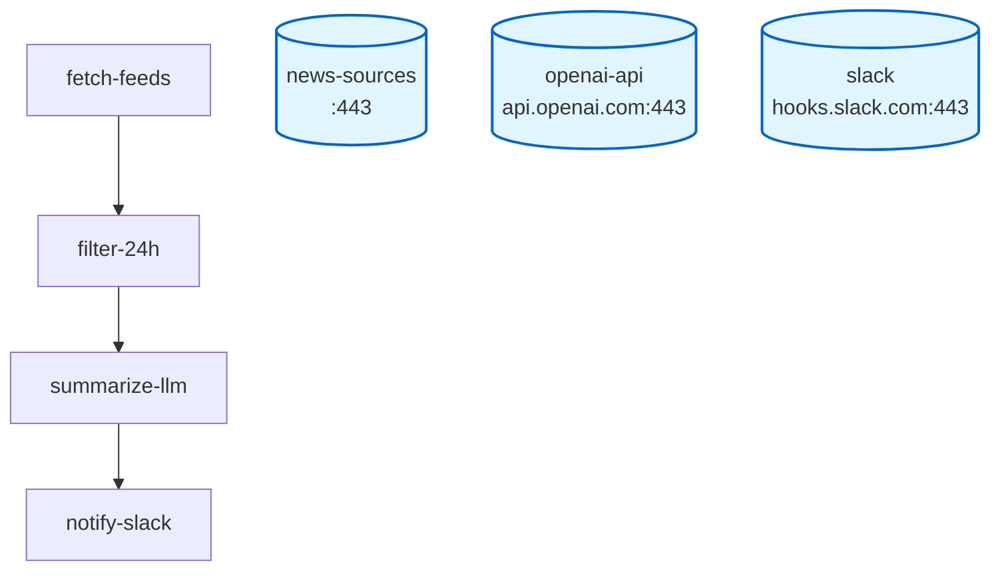

```mermaid
graph TD
    fetch-feeds[fetch-feeds]
    filter-24h[filter-24h]
    notify-slack[notify-slack]
    summarize-llm[summarize-llm]
    fetch-feeds --> filter-24h
    filter-24h --> summarize-llm
    summarize-llm --> notify-slack

    %% External Dependencies
    dep_news-sources[(news-sources<br/>:443)]
    style dep_news-sources fill:#e1f5ff,stroke:#0066cc,stroke-width:2px
    dep_openai-api[(openai-api<br/>api.openai.com:443)]
    style dep_openai-api fill:#e1f5ff,stroke:#0066cc,stroke-width:2px
    dep_slack[(slack<br/>hooks.slack.com:443)]
    style dep_slack fill:#e1f5ff,stroke:#0066cc,stroke-width:2px
```
